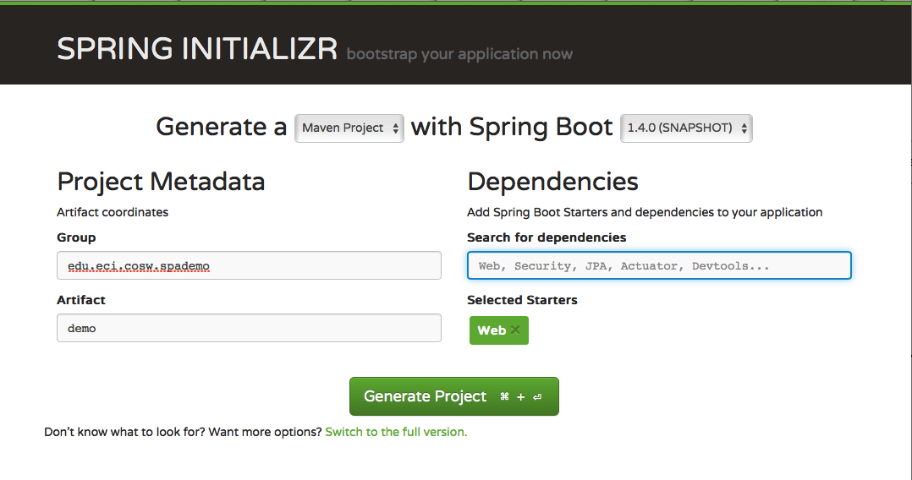
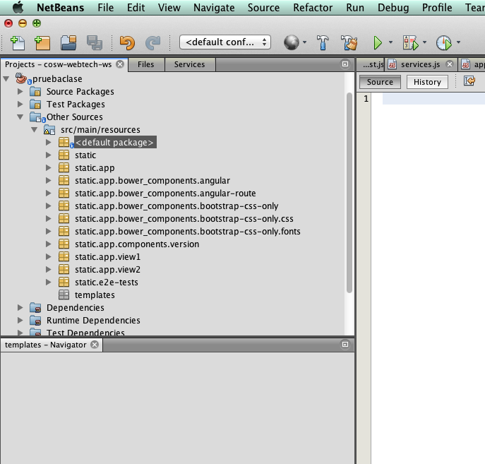

##Escuela Colombiana de Ingeniería
###Construcción de Software - COSW
###Taller - Prototipado de aplicaciones SPA

####Trabajo individual o en parejas

## Parte I.

1. Cree un proyecto base de Sprint Boot basado en Maven, que incluya dentro de sus dependencias los elementos Web (SpringMVC, Servidor Web embebido, etc). Para esto, abra el sitio de [Spring Intializer](https://start.spring.io), y cree un nuevo proyecto agregando el 'starter' Web:

	

2. Genere el proyecto, descárguelo y descomprímalo.
3. Para permitir que la actualización automática del contenido Web, se va a cambiar el servidor Web incluido por defecto en spring-boot Web starter (Tomcat) por Jetty. Para hacer esto, cabie esta dependencia:

	```xml
		<dependency>
			<groupId>org.springframework.boot</groupId>
			<artifactId>spring-boot-starter-web</artifactId>
		</dependency>
```

	por:

	```xml	
        <dependency>
            <groupId>org.springframework.boot</groupId>
            <artifactId>spring-boot-starter-web</artifactId>
            <exclusions>
                <exclusion>
                    <groupId>org.springframework.boot</groupId>
                    <artifactId>spring-boot-starter-tomcat</artifactId>
                </exclusion>
            </exclusions>
        </dependency>

        <dependency>
            <groupId>org.springframework.boot</groupId>
            <artifactId>spring-boot-starter-jetty</artifactId>
        </dependency>
```

4. En el proyecto recién generado, la ruta 'src/main/resources/static' corresponde al espacio donde se publicará el contenido Web (es decir, donde residirá la SPA). Para generar un 'adamiaje' de base, desde el directorio 

	```
	src/main/resources
```

	Clone el proyecto Angular-seed, de la siguiente manera:

	```
git clone --depth=1 --branch=master https://github.com/angular/angular-seed.git static
```

	Rectifique que quede una estructura estándar de Angular.js en la ruta src/main/resources/static

5. Modifique el archivo bower.json para especificar las dependencias de javascript requeridas para la SPA. En este caso, sólo se usará angular, angular-route, y las hojas de estilo de BootStrap:

	```json
{
  "name": "angular-seed",
  "description": "A starter project for AngularJS",
  "version": "0.0.0",
  "homepage": "https://github.com/angular/angular-seed",
  "license": "MIT",
  "private": true,
  "dependencies": {
    	"angular": "~1.4.0",
    	"angular-route": "~1.4.0",
    	"bootstrap-css-only": "~3.3.6"
  	 }
}
```
6. Rectifique que el archivo de configración de Bower (.bowerrc) tenga definido que las dependencias de javascript se descargarán en la ruta 'app/bower_components'.

7. En la ruta src/main/resources/static ejecute el comando de instalación de dependencias de bower

	```
bower install
```
	y rectifique que las dependencias antes configuradas se hayan descargado en app/bower_components. Igualmente, verifique que los elementos de la SPA sean accesibles desde el IDE:

	

8. Rectifique que la aplicación 'andamio' funcione. Para esto, ejecute:

	```
mvn spring-boot:run
```

	y abra en un navegador la ruta: http://localhost:8080/app/index.html


## Parte II.

Va a adaptar el 'andamiaje' de angular-seed para crear una nueva aplicación (una aplicación de tareas pendientes en línea), la cual tendrá tres vistas parciales:

* Una vista estática que sólo tendrá una descripción textual de la aplicación (view1).
* Una vista en la cual el usuario ingresará nuevas tareas pendientes (view2).
* Una vista en la cual el usuario consultará las tareas pedientes registradas hasta el momento (una nueva vista parcial).

1. Para crear la tercera vista parcial, haga una copia una de las carpetas de vistas existentes (view1 o view2) y póngale otro nombre (tanto a la carpeta como a su contenido).
2. En el archivo javascript de la vista (el cual contiene el módulo que configura las reglas de enrutamiento de la aplicación y su controlador) cambie el nombre del módulo y del controlador. Igualmente modifique la regla de enrutamiento para que coincida con el nuevo nombre y ruta del archivo html de la vista.
3. Para agregar el módulo antes definido a la aplicación, edite el archivo /app/index.html. Dado que en dicho archivo se defienen los módulos javascript a ser importados, agrege una una entrada a las existentes, incluyendo el módulo creado anteriormente:

	```xml
  <script src="bower_components/angular/angular.js"></script>
  <script src="bower_components/angular-route/angular-route.js"></script>
  <script src="app.js"></script>
  <script src="view1/view1.js"></script>
  <script src="view2/view2.js"></script>
  <script src="components/version/version.js"></script>
  <script src="components/version/version-directive.js"></script>
  <script src="components/version/interpolate-filter.js"></script>
```

4. En el mimso archivo html, en el menú de la SPA, agregue un enlace a la nueva vista. Recuerde que en lugar de incluir una ruta absoluta, debe incluir el nombre indicado en la configuración de enrutamiento de la vista (.when('/rutaxx') ... ).

	```html
  <ul class="menu">
    <li><a href="#/view1">view1</a></li>
    <li><a href="#/view2">view2</a></li>
    ... <-- Enlace a la nueva vista
    
  </ul>
```

5. Ahora, para que el módulo sea incluido en la aplicación a nivel lógico, edite el módulo de la aplicación (en la ruta app/app.js) y agregue el nombre del módulo creado (recuerde, el nombre lógico, no el nombre del archivo donde se creó!).

	```javascript
angular.module('myApp', [
  'ngRoute',
  'myApp.view1',
  'myApp.view2',
  'myApp.version'
]).
```

6. Rectifique que la aplicaición ya tenga las tres vistas.

##Parte III.

La funcionalidad de la vista del 'listado de tareas pendientes' es simplemente mostrar una lista de tareas que tiene las siguientes propiedades:

* Descripción de la tarea.
* Prioridad de 1 a 10.

1. Edite el controlador de la vista de 'tareas pendientes', e inyecte en éste el objeto $scope:

	```javascript	
	.controller('ControladorListado', ['$scope', function($scope){         
```

2. Agregue al controlador un atributo en el que se contendrán las tareas que se deben mostrar en la vista. Para probar el diseño de la vista, haga que -por ahora- dicho atributo tenga un listado estático de tareas (en este ejemplo, cada '{}' debe reempalzarse por un objeto javascript):

	```json
		$scope.listado=[
			{},
			{},
			{}
		];
```


3. En la vista de 'tareas pendientes' agregue una tabla usando la directiva ng-repeat (donde todo.propiedad1 y todo.propiedad2 deben reemplazarse por los nombres de las propiedades de los objetos contenidos en $scope.listado:

	```html
    <table class="table table-striped table-hover">
      <tbody>
        <tr ng-repeat="todo in listado">
          <td>{{todo.propiedad2}}</td>
          <td>{{todo.propiedad2}}</td>
        </tr>
      </tbody>
    </table>
```

4. Verifique el funcionamiento en el navegador. Si el estilo 'table table-striped table-hover' no funciona (se debería mostrar la tabla en colores intercalados), significa que no se ha importado la hoja de estilos de bootstrap. Para hacerlo, revise el encabezado de la página principal de la SPA (app/index.html), y rectifique que se esté usando:

	```html
<link rel="stylesheet" href="bower_components/bootstrap-css-only/css/bootstrap.css">
```
5. Para este ejercicio se requiere que desde la vista2, se capture la información (la tarea pendiente) que se muestra en la vista 'listado'. Para hacer esto, se va a implementar un servicio de tipo 'fábrica' que será inyectado a los controladores de las dos vistas. Dentro de la estructura planteada, se creará un directorio 'services' al mismo nivel de las vistas:

	```
		app\
			index.html 
			app.js 
			view1\
				controlador.js
				vista.html
			services\
			... <- definición de servicios comunes.
```

6. En la ruta antes indicada cree un archivo javascript que defina un módulo, y dentro de éste, un servicio de tipo 'fábrica' (cambie los nombres NOMBREMODULO/NOMBRESERVICIO a algo más adecuado):

	```javascript
'use strict';
angular.module('services.NOMBREMODULO', ['ngRoute'])

        .factory('NOMBRESERVICIO', function () {
            var data = {
                listado: []
            };
            return {
                getListado: function () {
                    return data.listado;
                },
                addTodo: function (todo) {
                    data.listado.push(todo);
                }};
        });
```        

7. Para incluír el módulo anterior de la aplicación, repita los pasos anteriormente descritos:
	* Incluir el archivo javascript en app/index.html
	* Incluir el módulo (nombrado anteriormente como 'services.XXXXXX') en el módulo princopal definido en app/app.js.

8. En el controlador de la vista2 inyecte

	```javascript
.controller('AyudaCtrl', ['$scope', 'NOMBRESERVICIO', function ($scope, NOMBRESERVICIO) {
		...
```
9. En el mismo controlador cree:
	* Las propiedades requeridas para capturar los detalles de una 'tarea pendiente'.
	* Una función que, al ser invocada, tome los valores de las dos propiedades definidas anteriormente, cree un objeto de tipo tarea pendiente, y lo agregue a la fábrica.

10. En la vista2 agregue los campos necesarios para capturar los detalles de una tarea pendiente. Asócielos con las propiedades correspondientes de su controlador con la directiva 'ng-model'.
11. Agregue un botón, y asóciele la función antes creada con la directiva 'ng-click'.
12. Verifique el funcionamiento de la vista2.
13. Modifique el controlador de la vista 'listado' para que en lugar de inicializarse con el conjunto de valores estáticos, sea inicializado con el contenido de la fábrica:

	```javascript
$scope.listado=fabrica.getListado();             
```
14. Verifique el funcionamiento global de la aplicación. Lo agregado en la vista dos, debe verse reflejado en la vista de 'listado'.

##Opcional

1. Revise la documentación del filtro [OrderBy](https://docs.angularjs.org/api/ng/filter/orderBy), y modifique la vista del listado para que el cliente pueda decidir con qué orden quiere visualizar las tareas pendientes.

